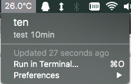

# bitbar
Put temperature in your Mac OS X menu bar.

## Installing plugin
- [Download latest BitBar release](https://github.com/matryer/bitbar/release) - requires Mac OS X Lion or newer (>= 10.7)
- [Download temp-io pulgins](https://raw.githubusercontent.com/temp-io/bitbar-plugins/master/temp-io.5m.py)
- Ensure the plugin is executable by running chmod +x temp-io.5m.py
- Move the plugin into your BitBar plugins directory and choose Refresh from one of the BitBar menus.
